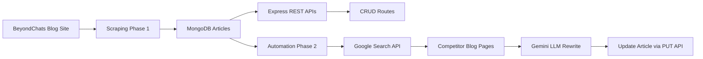

# 🚀 BeyondChats – AI-Powered Blog Automation System

An end-to-end full-stack automation system that scrapes blog articles, enriches them using competitor analysis and Large Language Models (LLMs), and exposes clean REST APIs for content management.

Built as part of the **BeyondChats Full Stack Developer Intern Assignment**.

---

## 📌 Table of Contents
- [Overview](#overview)
- [Key Features](#key-features)
- [System Architecture](#system-architecture)
- [Tech Stack](#tech-stack)
- [Project Structure](#project-structure)
- [Phase-wise Implementation](#phase-wise-implementation)
- [Setup & Installation](#setup--installation)
- [API Endpoints](#api-endpoints)
- [Automation Workflow](#automation-workflow-phase-2)
- [Error Handling & Design Decisions](#error-handling--design-decisions)
- [Future Improvements](#future-improvements)
- [Author](#author)

---

## 📖 Overview

This project automates the process of improving blog articles using AI.

### What it does:
- Scrapes the **5 oldest blog articles** from BeyondChats
- Stores them in MongoDB
- Exposes CRUD APIs to manage articles
- Automatically:
  - Searches Google for competitor articles
  - Scrapes competitor content
  - Uses **Google Gemini LLM** to improve the original article
  - Updates the article via REST API
  - Stores reference URLs

The system is designed to be **fault-tolerant, modular, and scalable**.

---

## ✨ Key Features

- ✅ Web scraping with correct chronological handling  
- ✅ MongoDB persistence with clean schema design  
- ✅ RESTful CRUD APIs (tested with Postman)  
- ✅ Google Search integration using Serper.dev  
- ✅ External article scraping with fallback logic  
- ✅ AI-powered rewriting using Google Gemini (**gemini-2.5-flash**)  
- ✅ End-to-end automation pipeline  
- ✅ ES Modules–based modern Node.js architecture  
- ✅ Clean Git history with logical commits  

---

## 🧠 System Architecture

## 🛠 Tech Stack

### Backend
Node.js
Express.js
MongoDB Atlas
Mongoose
Axios
Cheerio

### Automation & AI
Serper.dev (Google Search API)
Google Gemini (gemini-2.5-flash)
Prompt Engineering for LLMs

### Tooling
Postman (API testing)
Nodemon
Git & GitHub

## 📂 Project Structure

src/
├── app.js                 # Express app (ES Modules)
├── models/
│   └── Article.js         # MongoDB schema
├── controllers/
│   └── articleController.js
├── routes/
│   └── articleRoutes.js
├── scrapers/
│   └── scrapeBlogs.js     # Phase 1 scraper
├── automation/
│   ├── fetchArticles.js
│   ├── searchGoogle.js
│   ├── scrapeExternal.js
│   ├── llmRewrite.js
│   ├── updateArticle.js
│   └── runAutomation.js
└── .env (ignored)

## 🧩 Phase-wise Implementation
🔹 Phase 1 – Data Collection
Scraped 5 oldest blog articles

Used backward pagination for correct chronology

Stored articles in MongoDB

🔹 Phase 1.5 – Backend APIs
Implemented full CRUD APIs

Tested all endpoints using Postman

🔹 Phase 2 – Automation & AI
Fetch articles via API

Search competitors using Google Search API

Scrape competitor content

Rewrite articles using Gemini LLM

Update articles via PUT API

Store reference URLs

⚙️ Setup & Installation
1️⃣ Clone Repository
bash
Copy code
git clone <repo-url>
cd beyondchats-backend
2️⃣ Install Dependencies
bash
Copy code
npm install
3️⃣ Environment Variables (.env)
bash
Copy code
PORT=5000
MONGO_URI=your_mongodb_uri
SERPER_API_KEY=your_serper_key
GEMINI_API_KEY=your_gemini_key
4️⃣ Run Backend
bash
Copy code
npm run dev
5️⃣ Run Automation
bash
Copy code
node src/automation/runAutomation.js
🔌 API Endpoints
Method	Endpoint	Description
GET	/api/articles	Get all articles
GET	/api/articles/:id	Get article by ID
POST	/api/articles	Create article
PUT	/api/articles/:id	Update article
DELETE	/api/articles/:id	Delete article

🔁 Automation Workflow (Phase 2)
For each non-updated article:

Fetch article via API

Search title on Google

Scrape 2 competitor blogs

Rewrite content using Gemini

Update article via PUT API

Save reference URLs

The pipeline is resilient — failures in scraping do not crash the system.

⚠️ Error Handling & Design Decisions
External scraping failures are gracefully skipped

LLM output is validated before DB update

Automation runs sequentially to avoid rate limits

ES Modules used for consistency across backend & automation

LLM layer is model-agnostic (Gemini/OpenAI)

🚀 Future Improvements
Frontend dashboard (React)

Scheduled automation (cron jobs)

SEO score comparison

Versioning of articles

Authentication & role-based access

👤 Author
Palash Bhivgade
Final Year Electronics & Telecommunication Engineering Student
Aspiring Backend / Full Stack Developer

📧 Email: pdbhivgade77@gmail.com
🔗 GitHub: https://github.com/palashx7
🔗 LinkedIn: https://www.linkedin.com/in/palash-bhivgade-54089a191

⭐ Final Note
This project demonstrates real-world backend engineering, automation design, and AI integration — not just CRUD or toy examples.
